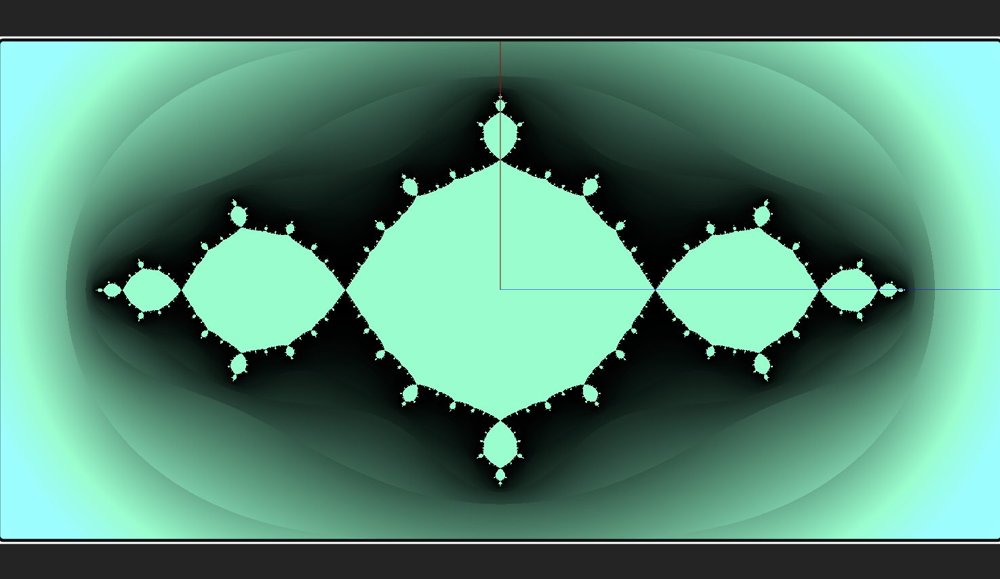

# Babylon.js 2D Julia Set DEMO



## Running locally

After cloning this repo, starting the devserver with the following commands at the root of this repo, and visiting `http://localhost:3000/` is all the simplest:

```
yarn
yarn dev
```

## Intruction

Note that WASD does work only when canvas is focused.

| Key / Scroll | Description |
|-|-|
| <kbd>W</kbd> | Up |
| <kbd>A</kbd> | Left |
| <kbd>S</kbd> | Down |
| <kbd>D</kbd> | Right |                                          |
| Scroll Up | Zoom In |
| Scroll Down | Zoom Out |
